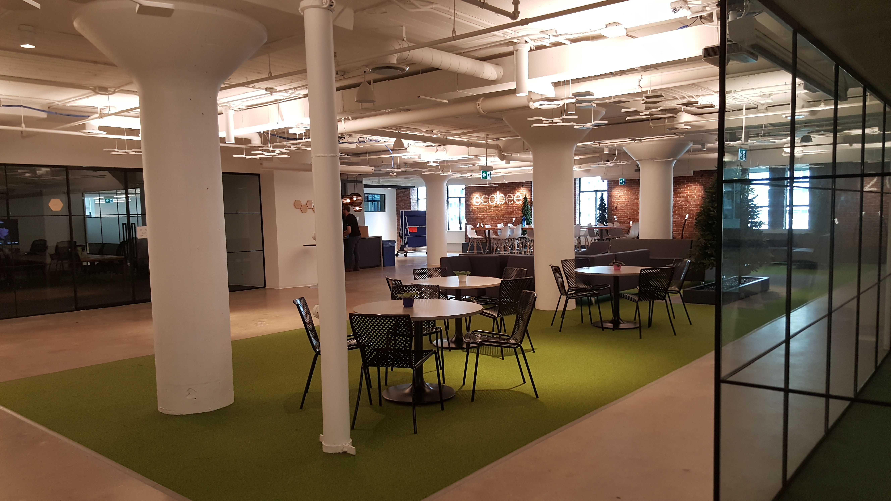

Back in May, I began my Professional Experience Year (PEY). [PEY](http://web.cs.toronto.edu/program/ugrad/pey.htm) is a program offered by the University of Toronto allowing students with a technical background to work at a company. This is analogous to the co-op programs in other Canadian universities (except that it's one year long). I decided that I would spend my PEY at [Ecobee](https://www.ecobee.com/).

Around a decade ago, Ecobee started selling smart, wifi-enabled thermostats. Unlike the other thermostats at the time, 'Ecobees' can be programmed remotely to set the temperature. This way, people can avoid heating and cooling their homes during hours of the day when no one is home. Instead, they can try proactively to adjust the temperature to where they want it before they get home. With rising energy costs and the creeping problem of climate change, it wasn't long before people began to realize the importance of such products. Today, there are other smart thermostats that have entered the marketplace. The most notable of Ecobee's competitors is [Nest Labs](https://nest.com/ca/), a company that was later acquired by Google for $3.2 billion. Despite getting vastly outspent by many of its competitors, Ecobee has managed to remain a competitive player in the thermostat market thanks to its accurate measurement of temperature, developer friendly platforms, ease of use, and support for customers.

_The company has started to use numerous bee related metaphors. The main office of Ecobee, seen above, is colloquially called as 'the hive' (This is not to be mistaken with Hive, one of our competitors)._

Ecobee is a growing midsize company. Within a couple of weeks, after I joined, the company received over $50 million in funding from Amazon, crossed the one million user threshold, and surpassed three hundred employees. Now, with the recent launch of the switch+ lightswitch, Ecobee is planning to harness growing IoT demands and expand past thermostats into the world of connected, smart homes.

I believe that spending time with a company of this size and stature will help me learn and grow as a developer. Expanding past the initial product of thermostats yields a new and exciting set of concerns for the company. Structurally, Ecobee is now focusing on separating services from a thermostat monolith into separate microservices that can scale laterally. With a growing number of users, it's almost every week when we are thinking of how best to facilitate the efficient transfer of large amounts of data. Ecobee is also starting to support a growing number of devices, including the recent relaunch of an iPad app and preparations to improve the mobile app as well. More platforms raise more questions about how to maintain the best user experience and transfer information to our devices with third-party vendors. This means that trade-offs need to be considered when approaching questions of maintaining consistent behavior across all platforms. It's challenges like these that will be ever present when aiming to develop good stable software. Challenges that I find are often easier to understand as a worker bee at 'the hive' rather than through courses at a university.

I was blown away by the training Ecobee had for new-hires and co-ops (including me!). Dispersed within your first month at Ecobee, all 'new bees' attend a set of mandatory training workshops. These workshops serve as an opportunity to meet people into the company, understand how the thermostat and light switch products operate, as well as gain insight into the general operating procedures values here at the company.

In one unique workshop, I spent an afternoon shadowing customer support representatives. While listening in on the customer calls, I couldn't help but think back to the Quarry Worker's Creed, stating:

> We who cut mere stones must always be envisioning cathedrals

The Quarry Worker's Creed a reminds us, engineers, to keep the bigger picture in mind when developing a product. The customer support team gets calls on almost all aspects of the thermostat and light switch products. While I was there, I heard calls about everything ranging from furnace problems, hardware defects and even how to interface with the out third-party integrations like apple home kit. This training does a good in setting up our understanding of our customer's desires. It has a huge impact on the features we prioritize and the overall designs of our products. In one iteration, the designers at Ecobee were pushing for a sleeker user interface (UI). After the design got released, our customer support was flooded with calls about the confusion on this new design. As designers sat in on the training, they were able to better realize the delicate balance that goes into a sleek UI without compromising user experience.

Like Spotify, software teams at 'the hive' are organized using [Chapters, Squads and Guilds](https://medium.com/project-management-learnings/spotify-squad-framework-part-i-8f74bcfcd761). Chapters are groups of people that have similar roles within the company. They tend to meet once a week to discuss similar problems faced within the squads. On the other hand, squads are a group of people working on a particular feature, product or service. Each squad may have people with all sorts of different backgrounds. For example, there is a LightSwitch squad that works on developing the Switch+. This squad might have electrical engineers, programmers, designers and marketers. When it comes to designing the light switch, the designers might find use in meeting with other designers around to company to discuss processes and best practices. Lastly, guilds are a means of organizing beyond the traditional roles in the company. Some guilds are formal, like guild-kotlin, which aims to promotes the use of the Kotlin programming language throughout the company. Others are less formal, like the soccer-guild, which are a group of people that meet every week to play soccer.

Another nice thing at Ecobee is the 1-1s. Outside of all of the other structure described above, every week everyone has a dedicated half-hour of time to meet with their manager and have personal discussions about how things are progressing.

My current role is as a full-stack developer with the web chapter on an internal squad. During the first week, I spent time pair-programming with other members of my squad and exploring the codebase on my own. This helped me get up to speed quickly without either me or the senior developers having to worry about making sure I hadn't 'missed anything' as I was trying to get up to speed. By the time week two and three came around, I was able to start writing code. Now I am able to look for things to work on myself with almost little guidance. My squad follows an agile methodology with daily standups and tight one week sprints.

One year is a long time, and I hope that I will have the opportunity to try out a variety of roles within Ecobee across many squads and guilds. For now, I am going to keep trying to be the best I can bee.
